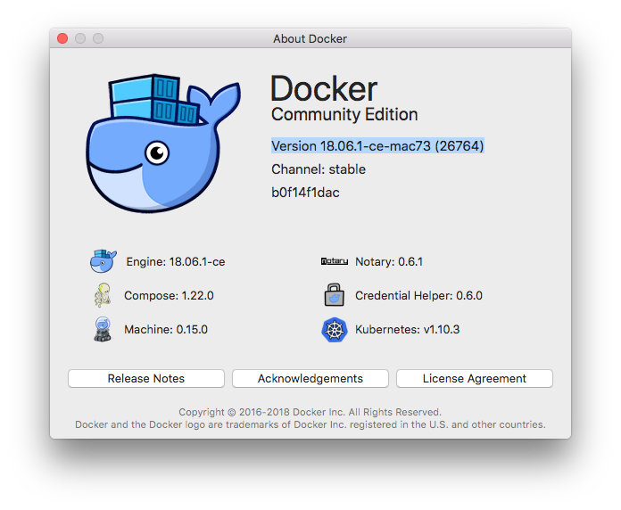
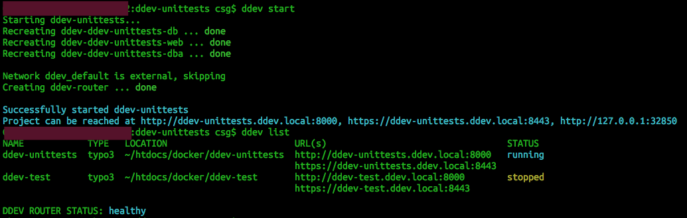

[<- back](../Readme.md)
# Notes: DDEV setup and first installation with composer

## Short overview
* startpoint is *composer.json* in your desired empty project folder, see example:

```
{
    "name": "csg/unit-tests",
    "description": "unit test test",
    "type": "project",
    "require": {
        "php": "^7.2",
        "typo3/minimal": "^9.5",
        "helhum/typo3-console": "dev-master",
        "typo3/cms-fluid-styled-content": "^9.5",
        "typo3/cms-info": "^9.5",
        "typo3/cms-tstemplate": "^9.5",
        "fluidtypo3/flux": "^9.1",
        "fluidtypo3/vhs": "^5.1",
        "fluidtypo3/fluidpages": "^4.3",
        "fluidtypo3/builder": "^1.2",
        "typo3/cms-form": "^9.5",
        "t3g/blog": "dev-master"
    },
    "require-dev": {
        "typo3/testing-framework": "^4.9",
        "friendsoftypo3/extension-builder": "dev-master",
        "typo3/cms-adminpanel": "dev-master"
    },
    "extra": {
        "typo3/cms": {
            "cms-package-dir": "{$vendor-dir}/typo3/cms",
            "web-dir": "public"
        }
    },
    "config": {
        "bin-dir": "bin",
        "vendor-dir": "vendor",
        "platform": {
            "php": "7.2.8"
        }
    },
    "authors": [{
        "name": "Christian Sonntag",
        "email": "christian.sonntag@fti.de"
    }]
}
```

* install composer if not done yet (https://getcomposer.org/download/)
* **_$ composer install_**
* final directory structure

```
mylocalmachine:ddev-test csg$ tree -L 2
.
|-- README.md
|-- bin
|   |-- doctrine-dbal -> ../vendor/doctrine/dbal/bin/doctrine-dbal
|   |-- fluid -> ../vendor/typo3fluid/fluid/bin/fluid
|   |-- typo3 -> ../vendor/typo3/cms-cli/typo3
|   `-- typo3cms -> ../vendor/helhum/typo3-console/typo3cms
|-- composer.json
|-- composer.lock
|-- public
|   |-- fileadmin
|   |-- index.php -> ../vendor/typo3/cms/index.php
|   |-- typo3 -> ../vendor/typo3/cms/typo3
|   |-- typo3conf
|   |-- typo3temp
|   `-- uploads
`-- vendor
    |-- autoload.php
    |-- cogpowered
    |-- composer
    |-- doctrine
    |-- guzzlehttp
    |-- helhum
    |-- mso
    |-- psr
    |-- swiftmailer
    |-- symfony
    |-- typo3
    |-- typo3fluid
    `-- vlucas

20 directories, 9 files
```

* install docker if not done yet (https://www.docker.com/get-started)
  * tested on mac with following version: 
```
Docker Community Edition Version 18.06.1-ce-mac73 (26764)
```


* install ddev if not done yet (on mac: install homebrew (https://brew.sh/index_de) then **_$ brew tap drud/ddev && brew install ddev_**)
  * tested on mac with following version:
```
mylocalmachine:ddev-unittests csg$ ddev version
web   	drud/ddev-webserver:v1.2.0
db    	drud/ddev-dbserver:v1.2.0 
dba   	drud/phpmyadmin:v1.2.0    
router	drud/ddev-router:v1.2.0   
commit	v1.2.0                    
domain	ddev.local                
cli   	v1.2.0
```

* in your project folder (where the composer.json file is located) run: **_$ ddev config_**
  * follow instructions.
  * ddev detects automatically that this is an TYPO3 project and generates an _AdditionalConfiguration.php_ file
  * it generates hidden **_.ddev_** folder where all DDEV settings are stored
  * further configuration is possible within yaml files
    * config.yaml
    * docker-compose.yaml
* **_$ ddev start_** to start local ddev vm
* **_$ ddev ssh_** into vm
* a file with name _FIRST INSTALL_ has to be created manually in the document root for the TYPO3 Installtool
* FE: http://ddev-test.ddev.local:8000
* BE: http://ddev-test.ddev.local:8000/typo3
* phpMyAdmin: http://ddev-test.ddev.local:8036
* basic install done
* activate/install needed extensions in TYPO3 backend in extensions manager. 

> At the moment of writing there appears some version conflict warnings with used extensions that can be ignored with "I know what i am doing" option.

## add line to /etc/hosts on your host machine (mac or whatever)

```
127.0.0.1 ddev-unittests.ddev.local
```

## further ddev settings in config.yaml

* changing port 80/443 to 8000/8443 if there is a used port or some kind of conflict
* changing webserver (nginx-fpm, apache-fpm, apache-cgi)
* for more see very good commented yaml files

## example screenshot



## l    inks
* https://github.com/drud/ddev
* https://ddev.readthedocs.io/en/latest/

[<- back](../Readme.md)