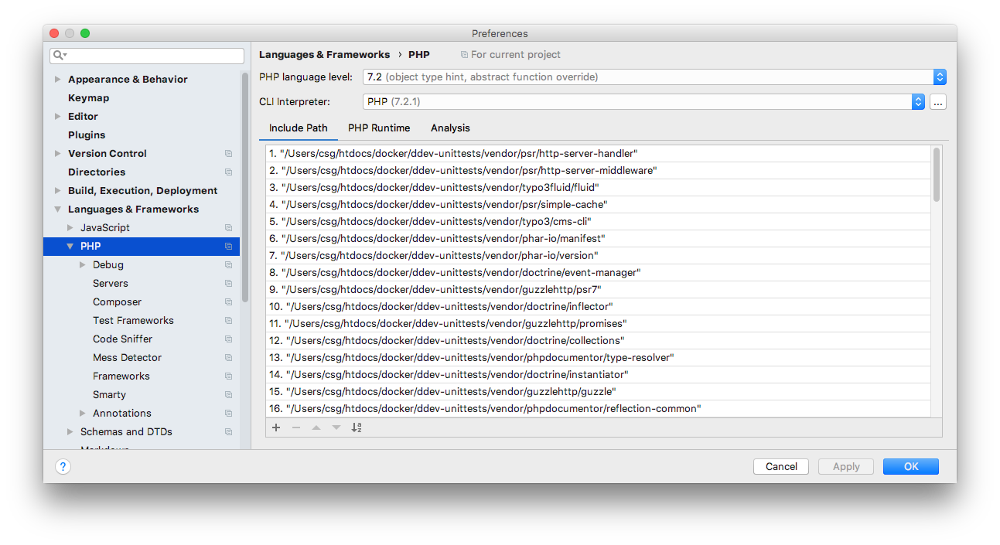
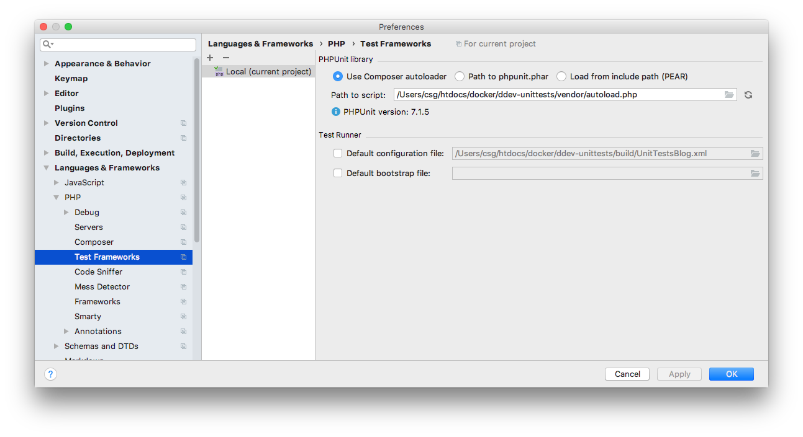
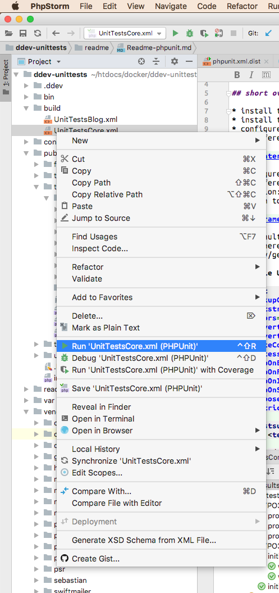
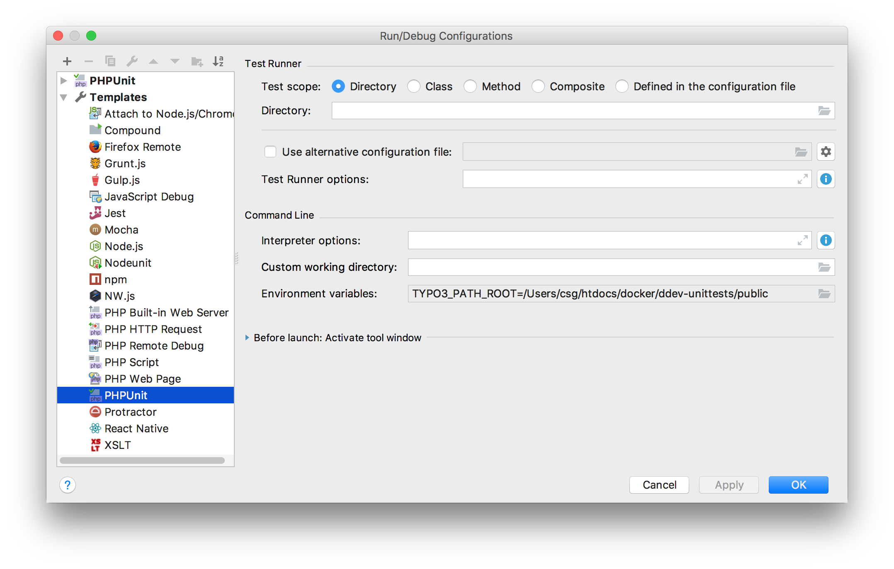
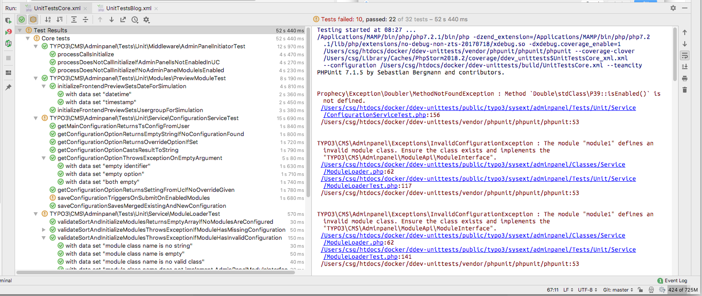
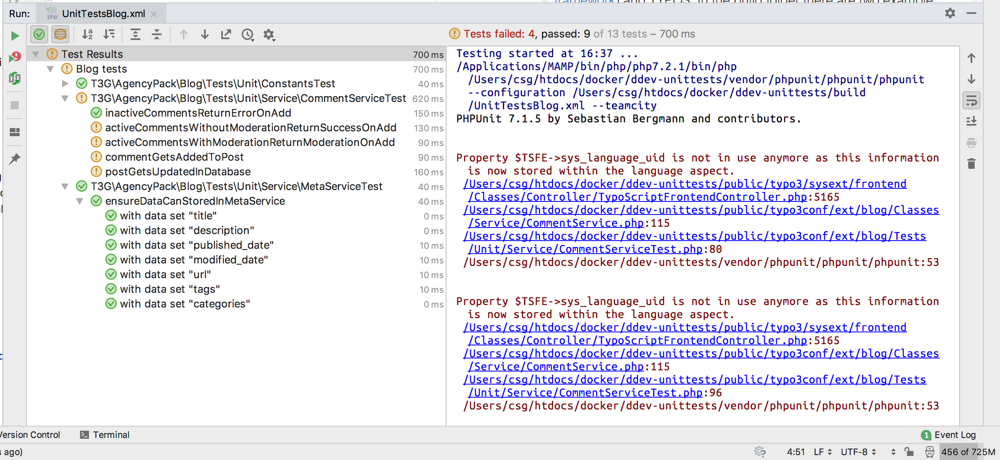

[<- back](../Readme.md)
# PHPUnit and TYPO3 with PHPStorm

* !!! This repo/setup is using [typo3/testing-framework](https://packagist.org/packages/typo3/testing-framework) that will hopefully get a better documentation in future.
* [Very good tutorial from Susanne Moog for TYPO3 here](https://www.youtube.com/watch?v=9zoHWNR5OcQ)
* [TYPO3 Unit testing](https://docs.typo3.org/typo3cms/extensions/phpunit/Introduction/Index.html) using extension [ext:phpunit](https://extensions.typo3.org/extension/phpunit/)

# TYPO3 PHPUnit links

* [Testing the Core](https://docs.typo3.org/typo3cms/ContributionWorkflowGuide/Testing/Index.html)
* [ext:extension_builder Unit tests](https://github.com/FriendsOfTYPO3/extension_builder/blob/8.7/Documentation/Developer/Unittests.rst)
* [Testing TYPO3's Core - Part I: Infrastructure](https://typo3.com/blog/testing-typo3s-core-part-i-infrastructure/)
* [Testing TYPO3’s Core - Part II: On Hardware & Dockers](https://typo3.com/blog/testing-typo3s-core-part-ii-on-hardware-dockers/)
* [Testing TYPO3’s Core - Part III: Unit Tests](https://typo3.com/blog/testing-typo3s-core-part-iii-unit-tests/)
* [Testing TYPO3’s Core - Part IV: Functional Tests](https://typo3.com/blog/testing-typo3s-core-part-iv-functional-tests/)
* [Testing TYPO3’s Core - Part V: Acceptance Tests](https://typo3.com/blog/testing-typo3s-core-part-v-acceptance-tests/)
* [Testing TYPO3’s Core - Part VI: Integrity Tests](https://typo3.com/blog/testing-typo3s-core-part-vi-integrity-tests/)
* [Testing TYPO3's Core - Part VII: A Historical View](https://typo3.com/blog/testing-typo3s-core-part-vii-a-historical-view/)
* [Testing TYPO3’s Core - Part VIII: Future](https://typo3.com/blog/testing-typo3s-core-part-viii-future/)

# more TYPO3 PHPUnit links

* [Unit Testing TYPO3](https://wiki.typo3.org/Unit_Testing_TYPO3)
* [Handout for workshops on Test-driven Development with TYPO3 CMS (by Oliver Klee)](https://github.com/oliverklee/tdd-reader)
* [Tea example (by Oliver Klee)](https://github.com/oliverklee/tea)

## Short overview

* install typo3/testing-framework with composer
* install t3g/blog with composer that includes examples unittest
* configure PHPStorm to use the correct php interpreter and autoloader
  * Preferences | Languages & Frameworks | PHP
  

  
* configure PHPUNIT in PHPStorm
  * Preferences | Languages & Frameworks | PHP | Test Frameworks
  * option: use composer autoloader, set path to composer autoload.php file
  * path to script (example, depending where your project is located): /Users/csg/htdocs/docker/ddev-unittests/vendor/autoload.php



  * default configuration file (example): /Users/csg/htdocs/docker/ddev-unittests/build/UnitTests.xml
    * there could be also used any other configuration file
    


  * copy/generate UnitTest.xml file in path mentioned before
  
**Example UnitTest.xml file:**
```xml
<phpunit
	backupGlobals="true"
	bootstrap="../vendor/typo3/testing-framework/Resources/Core/Build/UnitTestsBootstrap.php"
	colors="true"
	convertErrorsToExceptions="true"
	convertWarningsToExceptions="true"
	forceCoversAnnotation="false"
	processIsolation="false"
	stopOnError="false"
	stopOnFailure="false"
	stopOnIncomplete="false"
	stopOnSkipped="false"
	verbose="false"
	beStrictAboutTestsThatDoNotTestAnything="false"
>
	<testsuites>
		<testsuite name="Blog tests">
			<directory>../public/typo3conf/ext/blog/Tests/Unit/</directory>
		</testsuite>
	</testsuites>
    <filter>
        <whitelist>
            <directory>../public/typo3conf/ext/blog/Classes/</directory>
        </whitelist>
    </filter>
</phpunit>
``` 

* configure runtime configuration
  * use Template/PHPUNIT
    * option: directory
    * define environment variable: TYPO3_ROOT_PATH
      * example: /Users/csg/htdocs/docker/ddev-unittests/public
      



## Conclusion

This is a raw starting point for PHPUnit ([with the typo3/testing-framework](https://packagist.org/packages/typo3/testing-framework)) and TYPO3. In the build folder there are two example configurations.
One is the config copied from the typo3/testing-framework and the other is a modified copy of the testing-framework 
configuration for [ext:blog](https://packagist.org/packages/t3g/blog) which also includes and PHPUnit test folder.

**_Example screenshots:_**





[<- back](../Readme.md)